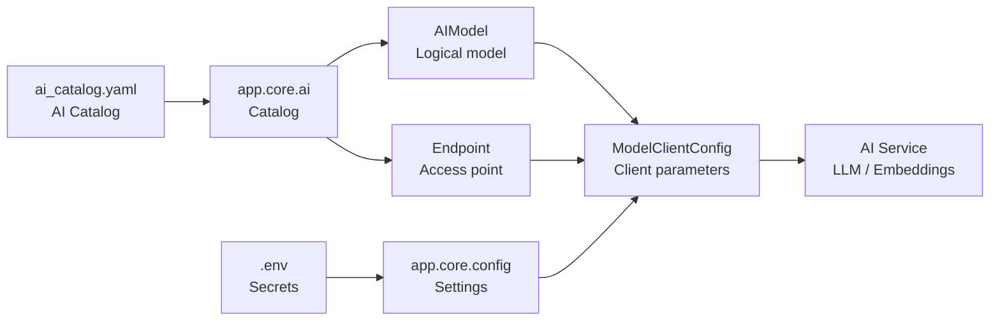

# AI Catalog Module

## Назначение

`app.core.ai` — модуль управления описанием AI-инфраструктуры приложения.

Модуль предоставляет единый механизм для:

- описания доступных AI-моделей;
- описания способов доступа к моделям;
- получения конфигурации для создания AI-клиентов.

Источник данных:

```
app/core/ai/ai_catalog.yaml
```

Каталог является частью конфигурации приложения и **не содержит секретов**.

---

# Архитектурная идея

В модуле разделены две сущности:

## AI Model

Логическая модель, которую использует приложение.

Примеры:

- `gpt-5.4-mini`
- `qwen3-embedding-4b`
- `text-embedding-3-small`

Модель описывает:

- назначение (`llm`, `embedding`);
- характеристики модели;
- доступные Endpoint'ы.

Модель не содержит:

- URL;
- API Key;
- параметры подключения.

---

## Endpoint

Конкретный способ доступа к AI-модели.

Endpoint описывает:

- тип API;
- адрес сервиса;
- источник секретов;
- поддерживаемые типы моделей.

Примеры:

- OpenRouter;
- vselLM;
- локальный llama.cpp сервер.

---

# Связь Model и Endpoint

Одна модель может быть доступна через несколько Endpoint'ов.

Например:

```
qwen3-embedding-4b

        |
        +── llama.cpp
        |
        +── другой inference server
```

Это позволяет:

- менять инфраструктуру без изменения сервисов;
- использовать одну модель у разных провайдеров;
- централизованно управлять AI-ресурсами.

---

# Общая схема



---

# Основные компоненты модуля

```
app/core/ai/

├── ai_catalog.yaml   # описание моделей и endpoint'ов
├── enums.py          # типы AI сущностей
├── models.py         # Pydantic-модели каталога
├── loader.py         # загрузка каталога
└── catalog.py        # публичный доступ к каталогу
```

---

# Публичный интерфейс

Сервис приложения не работает напрямую с YAML.

Он получает готовую конфигурацию:

```python
client_config = get_client_config(
    model_id="qwen3-embedding-4b",
    endpoint_id="llama_cpp",
)
```

Результат:

```python
ModelClientConfig
```

содержит всё необходимое для создания клиента:

- API тип;
- URL;
- API key.

---

# Ответственность слоёв

| Компонент | Ответственность |
|-|-|
| `ai_catalog.yaml` | описание AI-инфраструктуры |
| `loader.py` | загрузка и валидация каталога |
| `catalog.py` | поиск модели и формирование client config |
| `models.py` | структура данных |
| `Settings` | хранение секретов и окружения |
| AI-сервисы | использование готового клиента |

---

# Принципы

- Каталог не содержит секретов.
- Модель отделена от способа доступа.
- Сервисы работают через единый интерфейс.
- Добавление нового провайдера не требует изменения сервисов.
- Конфигурация AI централизована в одном месте.
