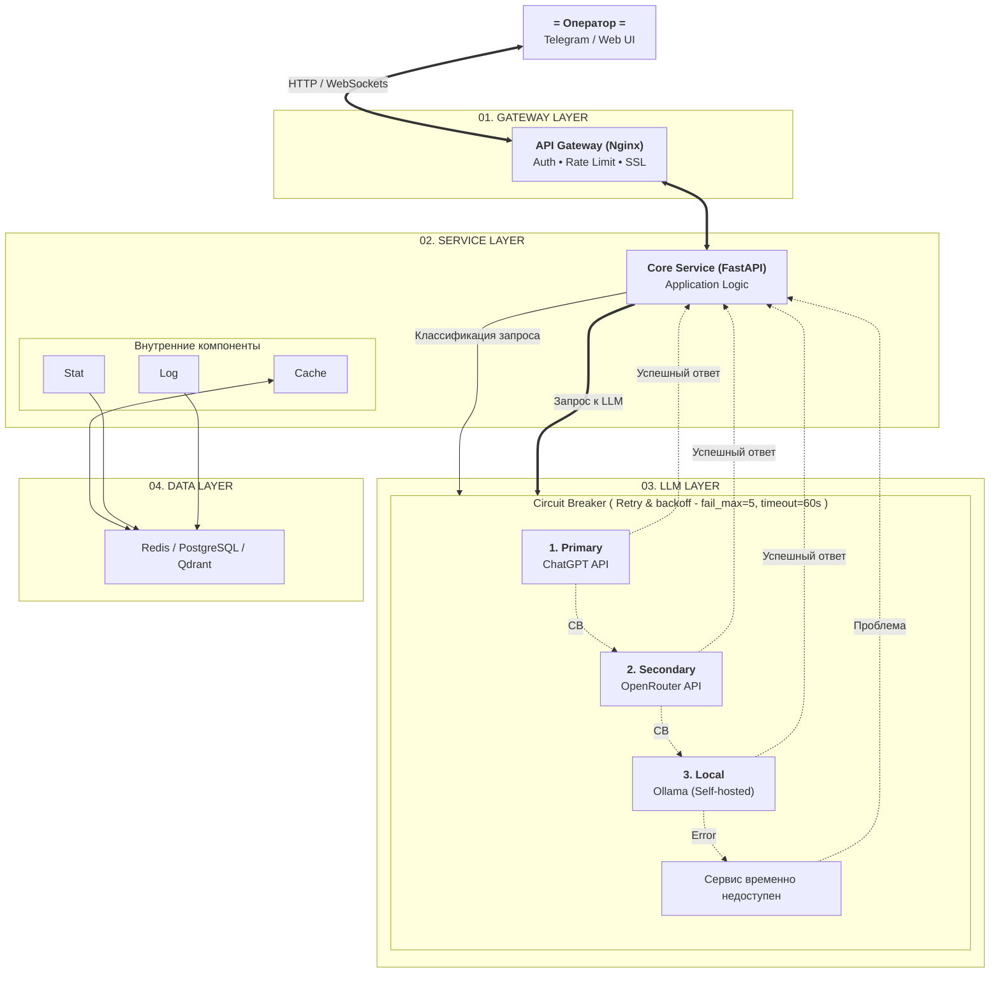

# Диаграмма

---
# ADR (Architecture Decision Record)

## ADR-001: Выбор паттерна взаимодействия

**Status:**  

Accepted (2026-06-14)  

**Context.**  

Проект — Интеллектуальный ассистент мониторинга и диагностики ИТ-инфраструктуры. Ожидаемая
нагрузка для крупной инфраструктуры (ИТ-департамент размером примерно в 150–300 человек) — для 50 активных операторов 90 сообщений/мин в пике, примерно в среднем 800 токенов на один запрос.
(0.5–8 секунд генерации), бюджет $40/мес.  

**Decision.**  

Выбран **Queue-based architecture**. Инженер вводит команду/запрос в CLI или Web. Бэкенд мгновенно принимает запрос, инженер видит статус тикета, ответ приходит ассинхронно.  

**Consequences.**

- Плюсы: Защита от пиковых нагрузок (Управление RPM) - сервер не упадет с ошибкой 504 Gateway Timeout.
- Минусы: Реализация архитектурно сложней.  

**Alternatives.**

- Request-Response & Streaming — отвергнут, ИИ-агенту нужно опрашивать разные системы (K8s, Prometheus, логи, базы данных), классический синхронный запрос быстро «упадет» по таймауту. Очередь решает эту проблему
- Fan-out - не наш случай, у нас короткий запрос/задача.

## ADR-002: Стратегия fault tolerance

**Decision.**  

- Primary — OpenAI gpt-4(5)-mini (ориентируемся на цена/качество).
- Fallback — Anthropic claude-sonnet-4-6. 
- Tertiary — Ollama qwen3:32b (локально, на случай полного отказа облаков).  
- Circuit Breaker — `tenacity`, fail_max=5, timeout=60s, **по одному на
провайдера**. Cache-Aside в Redis если допустимо, TTL по типу ответа, ключ —
`sha256(model + messages + temperature)`.  

**Consequences.**  

Доступность сервиса гарантируется даже при одновременном
падении OpenAI + Anthropic (Ollama держит UX «работаем в ограниченном режиме»).
Стоимость: дополнительные $5/мес за минимальный Anthropic-трафик + затраты на
self-hosted Ollama на VPS / On-premises.

# Потенциальные точки отказа

по одной на
слой. Для каждого слоя указывается: что произойдёт при его выпадении, какой паттерн
смягчает удар, как сервис деградирует (graceful degradation). Например: «LLM — все
провайдеры лежат → fallback на template-ответ из FAQ

1. GATEWAY LAYER
- Превышен Rate limit
  - Вводим ограничение на количество запросов в минуту
  - Блокируем тех кто дедосит
- Полное падение - сервис станет недоступен полностью
  - Важно иметь отказоустойчивое решение
2. SERVICE LAYER
- Не хватает ресурсов (память, CPU...)
  - Мониторим потребление, зарание решаем проблему
- Полное падение - сервис станет недоступен полностью
  - На уровне 1 отвечать - например "Сервис временно недоступен, повторите запрос позже"
3. LLM LAYER
- Недоступность провайдера(ов) и даже локального LLM
  - Ищем похожие запросы в кеш/faq - если есть отдаем. Если нет - даем приемлимый ответ
4. DATA LAYER
- Не хватает ресурсов (память, CPU...)
  - Мониторим потребление, зарание решаем проблему
- Полное падение - сервис потеряет доступ к stats/cache... Это не смертельно, возможно но увеличит скорость ответтов и вункциональность SERVICE LAYER
  - Важно иметь отказоустойчивое решение
