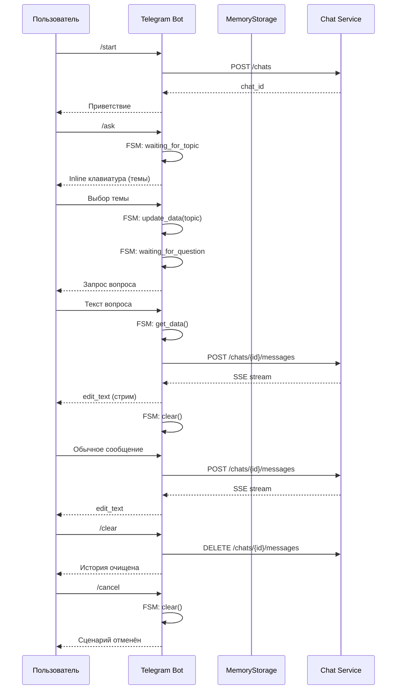

# Telegram Bot — ДЗ (aiogram 3)

## Описание выполнения

Создан Telegram-бот как тонкий клиент к backend chat-сервису. Бот не хранит историю диалогов и не знает про LLM — вся логика на стороне backend.

### Реализовано:

1. **Каркас бота**: `__main__.py`, `config.py`, `handlers/__init__.py`, `MemoryStorage`
2. **BackendClient**: 3 метода — `get_or_create_chat`, `send_message`, `clear_messages`
3. **Команды**: `/start`, `/help`, `/clear`, `/cancel`
4. **Текстовый handler**: catch-all для текстовых сообщений с SSE стримингом
5. **FSM-сценарий `/ask`**: состояния `waiting_for_topic`, `waiting_for_question`
6. **Inline клавиатуры**: `topics_kb()` с темами из домена диплома

## Архитектура



## Структура

```
bot/
├── __main__.py         # polling + dispatcher
├── config.py           # pydantic settings
├── states.py           # AskFlow states
├── handlers/
│   ├── __init__.py     # router registration
│   ├── commands.py     # /start, /help, /clear, /cancel
│   ├── fsm.py          # /ask handler
│   └── text.py         # catch-all text
├── keyboards/
│   └── inline.py       # topics_kb()
└── services/
    ├── backend_client.py  # 3 HTTP methods
    ├── error_handling.py  # error handling
    ├── streaming.py       # SSE rendering
    └── typing.py          # typing indicator
```
