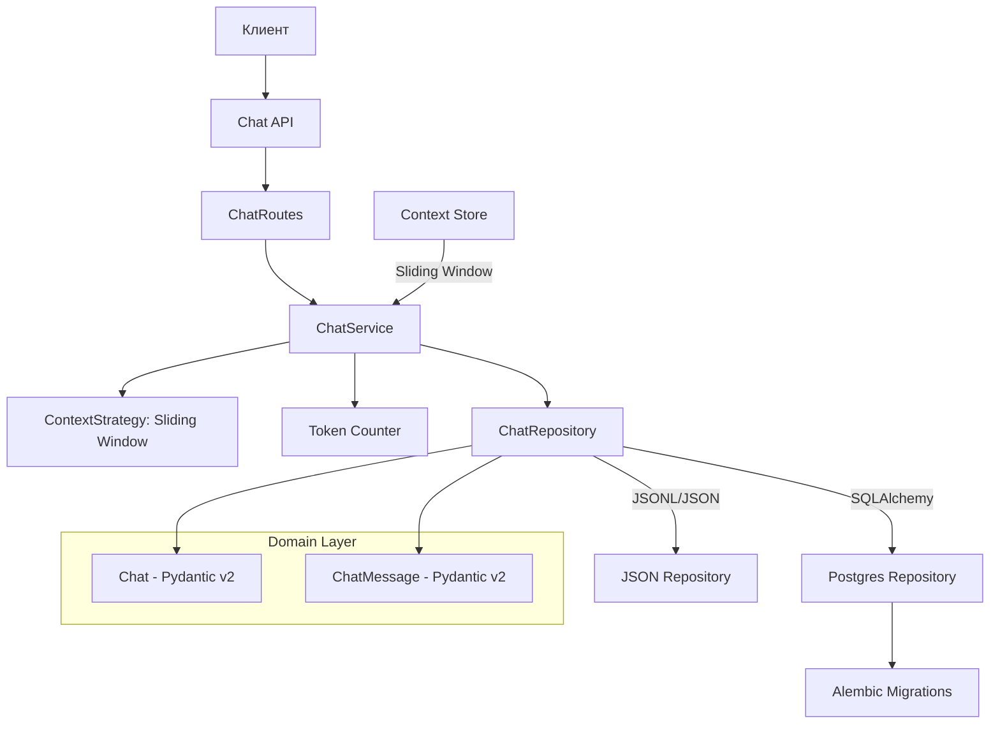
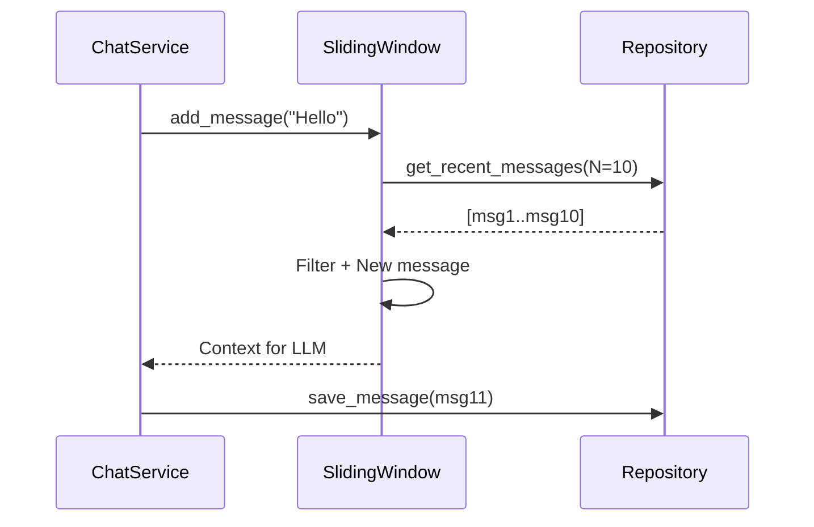

# Модуль чата

Архитектурная документация модуля чата (Блок 4.1)

## Архитектура



## Компоненты

### Доменные модели (Pydantic v2)

**Chat** — модель диалога:
- `id` — UUID диалога
- `user_id` — идентификатор пользователя
- `title` — заголовок диалога
- `messages` — список сообщений

**ChatMessage** — сообщение в диалоге:
- `id` — UUID сообщения
- `chat_id` — родительский диалог
- `role` — роль (user/assistant/system)
- `content` — текст сообщения
- `token_count` — количество токенов
- `created_at` — timestamp

### Репозитории

| Репозиторий | Технология | Описание |
|------------|-----------|----------|
| `JSONRepo` | JSONL + JSON | Файловое хранилище с атомарными операциями |
| `PostgresRepo` | SQLAlchemy | Реляционное хранилище с транзакциями |

### Сервис

**ChatService** управляет жизненным циклом чатов:

- **Создание** — генерация UUID, подсчёт токенов
- **Добавление сообщений** — контекстная стратегия + SSE-стриминг
- **Удаление** — soft delete с поддержкой контекста
- **Чтение** — paginated GET с поддержкой контекста

### Стратегия контекста: Sliding Window



**Почему Sliding Window?**

1. **Простота** — линейная сложность, легко реализовать
2. **Предсказуемость** — N последних сообщений всегда доступны
3. **Эффективность** — меньше токенов для LLM, быстрее генерация
4. **Совместимость** — работает с любым LLM без rate-limiting

**Альтернативы, которые не выбраны:**

- **Summary** — требует LLM для сжатия, сложно поддерживать
- **Hybrid** — избыточно для дипломной работы
- **Priority Queue** — требует меток важности, усложняет API

## API-эндпоинты

### POST /chats

Создание нового диалога.

```bash
curl -X POST 'http://localhost:8000/chats' \
  -H 'Content-Type: application/json' \
  -d '{"owner_external_id": "user-123", "interface": "web"}'
```

**Ответ**:
```json
{
  "chat_id": "uuid-123"
}
```

### POST /chats/{id}/messages

Добавление сообщения с SSE-стримингом.

```bash
curl -X POST 'http://localhost:8000/chats/{id}/messages' \
  -H 'Content-Type: application/json' \
  -d '{"role": "user", "content": "Привет"}' \
  -H 'Accept: text/event-stream'
```

**SSE-ответ:**
```
data: {"role": "assistant", "content": "Привет!", "token_count": 5}

data: {"role": "assistant", "content": " Как", "token_count": 3}

data: {"role": "assistant", "content": " я", "token_count": 2}

data: [DONE]
```

### GET /chats/{id}/messages

Получение сообщений диалога (paginated).

```bash
curl 'http://localhost:8000/chats/{id}/messages?skip=0&limit=10'
```

**Ответ:**
```json
{
  "messages": [
    {"role": "user", "content": "Привет"},
    {"role": "assistant", "content": "Привет, как дела?"}
  ],
  "total": 2
}
```

### DELETE /chats/{id}/messages

Soft delete сообщений с поддержкой контекста.

```bash
curl -X DELETE 'http://localhost:8000/chats/{id}/messages?skip=0&limit=5'
```

## Переключение хранилища

Переключение между JSON и Postgres через переменную окружения:

```bash
# JSON хранилище
export CHAT_REPOSITORY=json
uvicorn app.main:app --reload --env-file .env.example

# Postgres хранилище
export CHAT_REPOSITORY=postgres
uvicorn app.main:app --reload --env-file .env.example
```

## Тестирование

### Контракт репозитория

```bash
pytest tests/chat/test_repository_contract.py -v
```

### Маршруты

```bash
pytest tests/chat/test_routes.py -v
```

### Контекстная стратегия

```bash
pytest tests/chat/test_context_strategy.py -v
```

## Критерии приёмки

- [x] `uvicorn` стартует без ошибок (json + postgres)
- [x] `POST /chats` возвращает `chat_id`
- [x] `POST /chats/{id}/messages` (SSE) работает
- [x] `GET /chats/{id}/messages` возвращает сообщения
- [x] `DELETE /chats/{id}/messages` (soft delete) работает
- [ ] Тесты проходят без ошибок
- [ ] Документация актуальна
