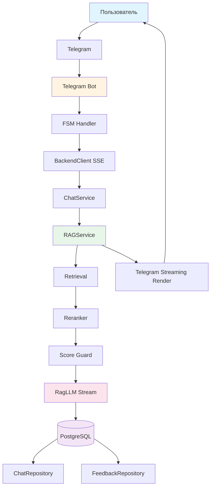
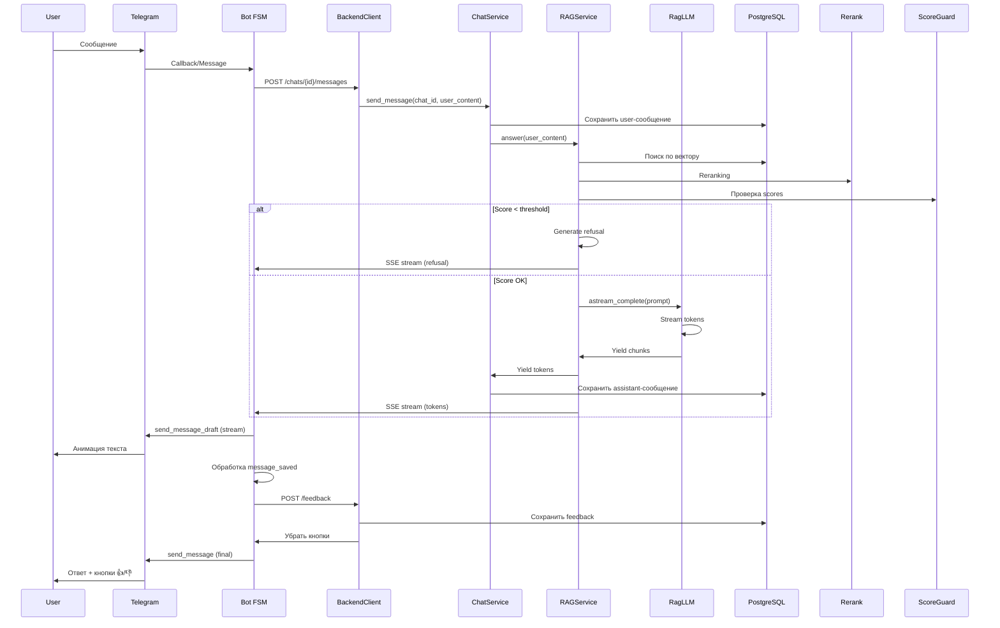
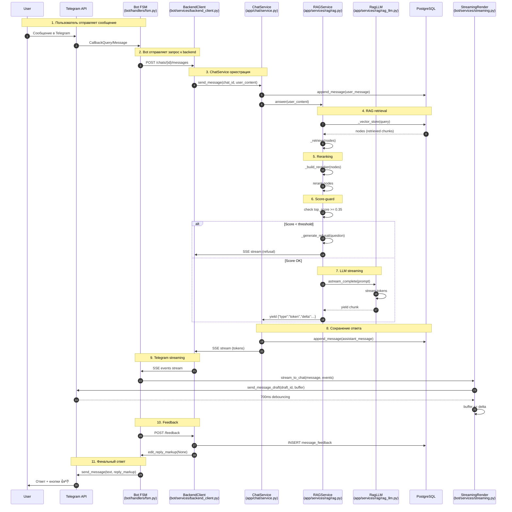

# Архитектура RAG-ассистента с Telegram-ботом

## Общая схема



## Конвеер сообщений



## Компоненты

### 1. Telegram Bot (`bot/`)

```
bot/
├── handlers/
│   ├── fsm.py              # FSM state management
│   ├── feedback.py         # Feedback buttons handler
│   └── admin.py            # Admin commands
├── services/
│   ├── backend_client.py   # SSE client to backend
│   └── streaming.py        # Telegram streaming render
└── config.py               # Bot configuration
```

**FSM Handler** (`bot/handlers/fsm.py`):
- Обработка входящих сообщений
- Парсинг callback_data: `fb:up:<uuid>` или `fb:down:<uuid>`
- Отправка запросов к backend через SSE

**Streaming Render** (`bot/services/streaming.py`):
- `send_message_draft` с debouncing (700ms)
- Финальный `send_message` с feedback-кнопками

### 2. Backend (`app/`)

```
app/
├── chat/
│   ├── routes.py           # FastAPI endpoints
│   ├── service.py          # ChatService orchestration
│   ├── repository.py       # ChatRepository
│   └── repositories/
│       └── pg_models.py    # SQLAlchemy models
├── services/
│   └── rag/
│       ├── rag.py          # RAG pipeline
│       └── rag_llm.py      # LlamaIndex adapter
└── routers/
    └── rag.py              # /rag/query endpoint
```

**ChatService** (`app/chat/service.py`):
- Оркестрация диалога
- Сохранение истории сообщений
- Интеграция с RAGService

**RAGService** (`app/services/rag/rag.py`):
- Retrieval через векторный поиск
- Reranking через bge-reranker-v2-m3
- Score-guard (threshold: 0.35)
- Генерация ответов с цитатами

**RagLLM** (`app/services/rag/rag_llm.py`):
- Адаптер над OpenAI-compatible API
- `astream_complete()` возвращает async generator
- `stream_chat()` для диалоговых сообщений

### 3. База данных

**Таблицы**:
- `chats` - информация о чатах
- `chat_messages` - сообщения пользователей и ассистента
- `message_feedback` - оценки 👍/👎

**Модель Feedback**:
```python
class MessageFeedbackRow(Base):
    id: UUID
    message_id: UUID
    owner_external_id: str
    value: str  # "up" или "down"
    created_at: datetime
    
    __table_args__ = (
        UniqueConstraint("owner_external_id", "message_id"),
    )
```

## SSE Event Contract

```json
{
  "type": "token",
  "delta": "chunk of text"
}
```

```json
{
  "type": "message_saved",
  "message_id": "uuid-4"
}
```

```json
{
  "type": "sources",
  "data": [
    {
      "file_name": "doc.pdf",
      "page": 5,
      "score": 0.85,
      "snippet": "...relevant text..."
    }
  ]
}
```

```json
{
  "type": "done"
}
```

## Поток данных

```
1. User → Telegram → Bot
2. Bot → POST /chats/{id}/messages
3. Backend → RAG retrieval + reranking
4. Backend → Score-guard check
5. Backend → LLM streaming
6. Backend → SSE stream to Bot
7. Bot → send_message_draft (animated)
8. Bot → POST /feedback (on buttons click)
9. Bot → send_message (final with buttons)
10. User sees response + feedback buttons
```

## Детальный конвеер токенов (с классами и методами)



## Методы отправки и получения (с привязкой к коду)

### Отправка токенов (Backend → Bot)

| Шаг | Класс | Метод | Файл | Код |
|-----|-------|-------|------|-----|
| **RAGService** | `RAGService.answer()` | `yield {"type":"token","delta":...}` | `app/services/rag/rag.py:266-380` | `yield {"type": "token", "delta": chunk}` |
| **ChatService** | `ChatService.send_message()` | `yield {"type":"token","delta":...}` | `app/chat/service.py:186-200` | `yield {"type": "token", "delta": event["delta"]}` |
| **BackendClient** | `BackendClient.send_message()` | `async for event in response.aiter_bytes()` | `bot/services/backend_client.py:150-180` | `async for chunk in response.aiter_bytes():` |
| **Bot FSM** | `on_question_received()` | `await stream_to_chat(message, events)` | `bot/handlers/fsm.py:52-80` | `await stream_to_chat(message, events, chat_id=chat_id)` |

### Получение токенов (Bot → Telegram)

| Шаг | Класс | Метод | Файл | Код |
|-----|-------|-------|------|-----|
| **StreamingRender** | `stream_to_chat()` | `await message.bot.send_message_draft()` | `bot/services/streaming.py:55-95` | `await message.bot.send_message_draft(...)` |
| **StreamingRender** | `_send_final()` | `await message.bot.send_message()` | `bot/services/streaming.py:100-120` | `await message.bot.send_message(...)` |

### Обработка feedback (Bot → Backend)

| Шаг | Класс | Метод | Файл | Код |
|-----|-------|-------|------|-----|
| **Bot FSM** | `on_feedback()` | `await backend.post_feedback()` | `bot/handlers/fsm.py:83-144` | `await backend.post_feedback(...)` |
| **BackendClient** | `BackendClient.post_feedback()` | `r = await client.post(...)` | `bot/services/backend_client.py:190-210` | `r = await client.post("/feedback", ...)` |
| **ChatService** | `post_feedback()` | `await s.execute(insert)` | `app/chat/routes.py:220-240` | `await s.execute(insert, ...)` |

## SSE Event Flow

```
RAGService.answer() 
    ↓
    yield {"type":"token","delta":"chunk"}
    ↓
ChatService.send_message()
    ↓
    yield {"type":"token","delta":"chunk"}
    ↓
BackendClient._sse_stream()
    ↓
    async for event in response.aiter_bytes():
        yield event
    ↓
Bot FSM.on_message()
    ↓
    await stream_to_chat(message, events)
    ↓
StreamingRender.stream_to_chat()
    ↓
    async for event in events:
        buffer += event["delta"]
        await send_message_draft(buffer)
    ↓
Telegram API
    ↓
    send_message_draft(draft_id, buffer)
    ↓
User sees animated text
```

## Ключевые точки синхронизации

1. **RAGService.answer()** → **ChatService.send_message()**
   - RAGService генерирует события
   - ChatService пересылает их без изменения

2. **ChatService.send_message()** → **BackendClient._sse_stream()**
   - SSE stream отправляется боту
   - Бот получает события через `aiter_bytes()`

3. **BackendClient._sse_stream()** → **Bot FSM.on_message()**
   - Bot FSM принимает events из SSE
   - Передаёт в StreamingRender

4. **Bot FSM.on_message()** → **StreamingRender.stream_to_chat()**
   - StreamingRender обрабатывает события
   - Отправляет через `send_message_draft`

5. **StreamingRender.stream_to_chat()** → **Telegram API**
   - `send_message_draft` с debouncing (700ms)
   - Финальный `send_message` с feedback-кнопками

## Обработка message_saved

```mermaid
flowchart LR
    A[LLM завершает генерацию] --> B[RAGService.answer()]
    B --> C{yield message_saved?}
    C -->|Да| D[message_id = uuid4()]
    D --> E[yield {"type":"message_saved","message_id":id}]
    E --> F[ChatService.send_message()]
    F --> G[Сохранить в DB]
    G --> H[yield {"type":"message_saved","message_id":id}]
    H --> I[BackendClient._sse_stream()]
    I --> J[Bot FSM.on_message()]
    J --> K[stream_to_chat()]
    K --> L[Сохранить assistant_message_id]
    L --> M[feedback_kb(message_id)]
    M --> N[send_message(reply_markup)]
```

## Callback Data Parsing

```python
# bot/handlers/fsm.py:95-105
cb.data = "fb:up:2168e7fb-52b6-4e3e-b774-946b181e095c"

# Шаг 1: Убираем префикс
rest = cb.data[len(f"{FEEDBACK_CB_PREFIX}:"):]  # "up:2168e7fb-52b6-4e3e-b774-946b181e095c"

# Шаг 2: Парсим value и uuid (UUID содержит :)
parts = rest.split(":", 1)  # ["up", "2168e7fb-52b6-4e3e-b774-946b181e095c"]
value = parts[0]  # "up"
message_id = parts[1]  # UUID строка
```

## Дебаунсинг в Telegram

```python
# bot/services/streaming.py:45-50
DRAFT_MIN_INTERVAL_SEC = 0.7  # 700ms

async for event in events:
    if event["type"] == "token":
        now = monotonic()
        if now - last_draft_at < DRAFT_MIN_INTERVAL_SEC:
            continue  # Пропускаем, чтобы не перегрузить Telegram
        await send_message_draft(buffer)
        last_draft_at = now
```

## Финальный ответ с кнопками

```python
# bot/services/streaming.py:100-120
if buffer:
    reply_markup = feedback_kb(assistant_message_id) if assistant_message_id else None
    await message.bot.send_message(
        chat_id=message.chat.id,
        text=buffer,
        reply_markup=reply_markup,  # 👍 / 👎
        parse_mode=ParseMode.MARKDOWN_V2,
    )
```

## Feedback кнопки

```python
# bot/keyboards/inline.py
def feedback_kb(message_id: str | None):
    kb = InlineKeyboard()
    if message_id:
        kb.add(
            InlineKeyboardButton("👍", callback_data=f"fb:up:{message_id}"),
            InlineKeyboardButton("👎", callback_data=f"fb:down:{message_id}"),
        )
    return kb
```

## Удаление кнопок после feedback

```python
# bot/handlers/fsm.py:115-120
await backend.post_feedback(...)
await cb.answer("Спасибо за оценку!")
# Кнопки автоматически удаляются после сохранения feedback
# (backend не отправляет новые кнопки)
```

## Ключевые зависимости

| Компонент | Технология |
|-----------|------------|
| Bot | aiogram 3.x |
| Backend | FastAPI, Starlette |
| Database | PostgreSQL, SQLAlchemy 2.0, Alembic |
| RAG | LlamaIndex, LangChain |
| Embeddings | bge-m3 |
| Reranker | bge-reranker-v2-m3 |
| LLM | OpenAI-compatible API |
| Streaming | SSE (Server-Sent Events) |

## Метрики производительности

| Метрика | Целевое значение | Измерение |
|---------|------------------|-----------|
| RAG retrieval time | < 100ms | `time.time()` в `_retrieve()` |
| Reranking time | < 200ms | `time.time()` в `_build_reranker()` |
| LLM first token | < 1s | `time.time()` в `astream_complete()` |
| Telegram draft rate | ~15 drafts/sec | `DRAFT_MIN_INTERVAL_SEC = 0.7` |
| Feedback latency | < 500ms | `time.time()` в `on_feedback()` |

## Точки входа в конвеер

### 1. POST /chats/{id}/messages
```python
# app/chat/routes.py:140-160
@router.post("/messages")
async def chat_message(
    request: ChatMessageRequest,
    chat_id: UUID = Path(...),
    service: ChatService = Depends(get_chat_service),
):
    async def event_generator():
        async for event in service.send_message(chat_id, request.content):
            yield event
        yield {"type": "done"}
    
    return StreamingResponse(
        event_generator(),
        media_type="text/event-stream",
    )
```

### 2. POST /feedback
```python
# app/chat/routes.py:220-240
@router.post("/messages/{message_id}/feedback")
async def post_feedback(
    request: FeedbackRequest,
    message_id: UUID = Path(...),
    service: ChatService = Depends(get_chat_service),
):
    await service.post_feedback(message_id, request.value)
    return {"status": "saved"}
```

### 3. GET /rag/query (синхронный)
```python
# app/routers/rag.py:36-43
@router.post("/query")
async def query_rag(
    request: RAGQueryRequest,
    rag: RAGService = Depends(get_rag),
):
    result = await rag.answer(request.question)
    return RAGQueryResponse(**result)
```

## Настройка

### Environment Variables

```bash
# Bot
BOT_TOKEN=...
BOT_ADMIN_IDS=...

# Backend
DATABASE_URL=postgresql+asyncpg://...
RAG_EMBEDDING_MODEL=bge-m3
RAG_RERANKER_MODEL=bge-reranker-v2-m3
RAG_SCORE_THRESHOLD=0.35
LLM_API_KEY=...
LLM_BASE_URL=...
LLM_MODEL=gpt-4o-mini

# LlamaIndex
LLAMA_INDEX_LOG_LEVEL=WARNING
```

### Docker Compose

```yaml
services:
  app:
    build: .
    ports: ["8000:8000"]
    depends_on: [postgres, llama-cpp]
    
  bot:
    build: bot
    ports: ["8080:8080"]
    depends_on: [app]
    
  postgres:
    image: postgres:16
    volumes: [pg-data:/var/lib/postgresql/data]
    
  llama-cpp:
    image: ghcr.io/ollama/ollama:latest
    ports: ["11434:11434"]
```

## Точки входа

### Bot
```python
# bot/main.py
from aiogram import Bot, Dispatcher
from bot.handlers import router

async def main():
    bot = Bot(token=BOT_TOKEN)
    dp = Dispatcher()
    dp.include_router(router)
    await dp.start_polling(bot)
```

### Backend
```python
# app/main.py
from fastapi import FastAPI
from app.chat.routes import router as chat_router
from app.routers.rag import router as rag_router

app = FastAPI()
app.include_router(chat_router, prefix="/chats")
app.include_router(rag_router, prefix="/rag")
```

## Мониторинг

### Логирование
- `bot.handlers.fsm` - обработка сообщений
- `app.chat.service` - оркестрация чата
- `app.services.rag.rag` - RAG pipeline
- `app.services.rag.rag_llm` - LLM calls

### Метрики
- Время ответа RAG
- Количество токенов
- Score распределение
- Feedback ratio (up/down)

### Структура логов

```python
# Пример логирования в RAGService
logger.info("RAG: retrieval completed", 
    query=query,
    nodes_count=len(nodes),
    top_score=top_score,
    latency_ms=time.time() - start_time)

# Пример логирования в Bot FSM
logger.info("Bot: streaming started", 
    chat_id=chat_id,
    message_id=message_id,
    events_count=len(events))

# Пример логирования в StreamingRender
logger.info("TG: draft sent", 
    draft_id=draft_id,
    token_count=len(buffer),
    latency_ms=now - last_draft_at)
```
